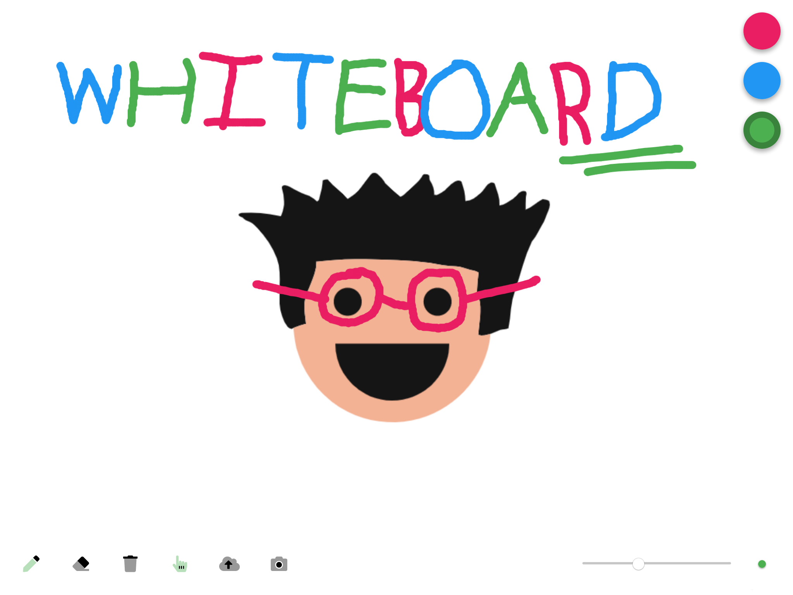

# Whiteboard

Super-simple shared whiteboard that supports drawing (with pen support), image
uploading and screenshotting. Once deployed, visit
`https://<host>/<whiteboard_id>` to start drawing. You can also visit
`https://<host>` to get an automatically generated whiteboard ID. Share your
link with others to start collaborating.

10 seconds after the last user disconnects from the whiteboard, it will be
deleted from the server and any drawings (that haven't been screenshotted) will
be lost.

## Deployment

There are 2 components that need to be deployed: the Node.js Socket.IO server
and the Vue.js single-page app.

### Server

This can be deployed pretty much anywhere. You'll need to set a couple of
environment variables first:

- `PORT`: port the server listens on (defaults to `9090` if unset)
- `FONTAWESOME_NPM_AUTH_TOKEN`: your Font Awesome Pro auth token (not actually
  needed by the server but dependencies won't install without it set)

To start the server, run `yarn install` then `yarn start`.

### Client

This is intended to be deployed with Netlify. You'll need to set a couple of
environment variables first:

- `VUE_APP_SOCKET_URI`: URI of your Socket.IO server (should include `https://`)
- `FONTAWESOME_NPM_AUTH_TOKEN`: your Font Awesome Pro auth token for access to
  duotone icons

